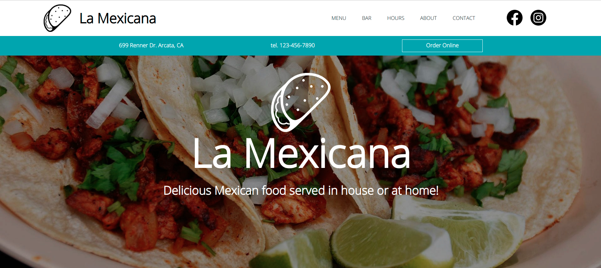

    <h1 align="center">Project - Restaurant</h1>

A Mexican Restaurant website catering to all.

   <a align="center" href="https://ec-rilo.github.io/project-restaurant/"><strong>View Live >></strong></a>

## ES6 and Webpack

This project was my first introduction to webpack and ES6 Modules. Throughout the process I learned practices on how to apply
ES6 Modules to my code as well as multiple resources to reference when using webpack. I refined my usage of DOM Manipulation with this project.
More then 80% of this project is made using javascript. There is also some slight usage of node.

